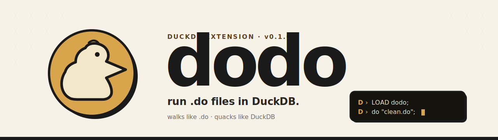
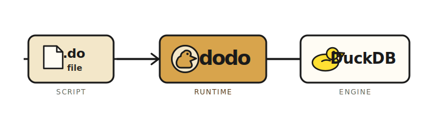
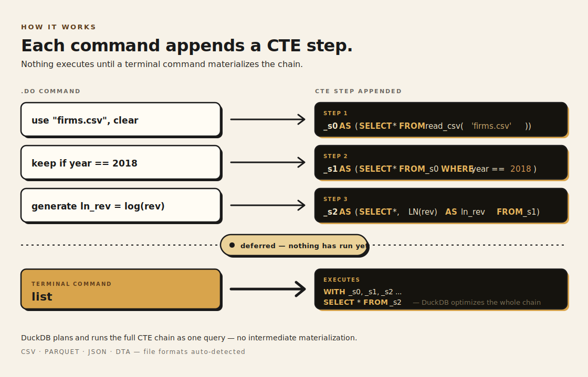
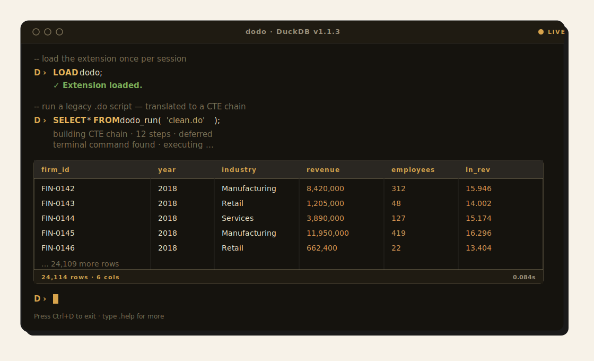
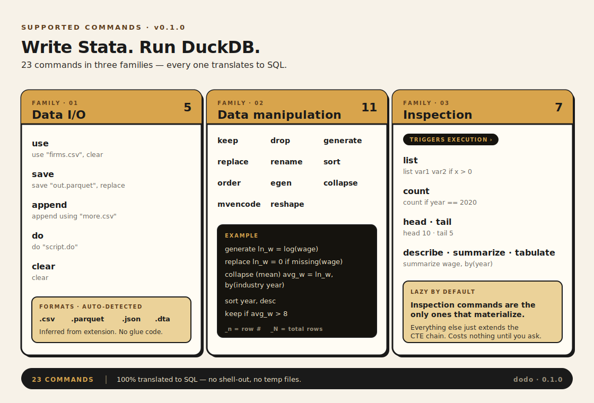

<!-- dodo · README.md
     Walks like .do. Quacks like DuckDB.
     Asset kit lives in /assets — light/dark hero, CTE chain diagram,
     commands cheatsheet, terminal demo, social card, logos, favicon. -->

<p align="center">
  <picture>
    <source media="(prefers-color-scheme: dark)" srcset="assets/dodo-hero-dark.svg">
    
  </picture>
</p>

<p align="center">
  
  
  
  
</p>

<p align="center">
  <strong>Run <code>.do</code> files in DuckDB.</strong><br>
  Walks like <code>.do</code>. Quacks like DuckDB.
</p>

---

## What is dodo?

dodo is a DuckDB extension that lets you write `.do` commands directly in DuckDB. Commands translate to SQL under the hood and execute on DuckDB's analytical engine — preserving familiar data-cleaning scripts while moving compute to a modern, columnar runtime.

<p align="center">
  
</p>

### Why?

- **Bring old `.do` workflows back to life** — keep the scripts your team already trusts, lose the licensing.
- **Lazy by default** — every command appends a CTE step; nothing executes until you ask for results.
- **One engine, every format** — read CSV, Parquet, JSON and `.dta` through the same commands.
- **Undo everything** — made a mistake? `undo`. Changed your mind? `redo`. Full `history` of every step.

---

## How it works

Each command becomes one CTE step in a chain that DuckDB plans and executes as a single query. Inspection commands (`list`, `count`, `head`, …) are the only triggers that materialize the chain.

<p align="center">
  
</p>

By default, `use` materializes the source file into `dodo._current` so repeated queries don't re-read disk. Use `use "file.csv", lazy` to skip materialization.

---

## Quick start

### 1. Build

```bash
git clone --recurse-submodules https://github.com/codedthinking/dodo.git
cd dodo
make release
./build/release/duckdb
```

### 2. Use

```sql
use "firms.csv", clear;
keep if year >= 2020;
generate profit = revenue - cost;
collapse (mean) avg_profit = profit, by(sector);
list;
```

Commands end with `;` in the DuckDB REPL — this is a DuckDB convention, not a Stata one. Inside `.do` files, each line is one statement and no semicolons are needed:

```sql
do "analysis/clean.do";
list;
```

<p align="center">
  
</p>

---

## dodoc — standalone .do-to-SQL compiler

`dodoc` compiles `.do` files to SQL without DuckDB. No dependencies, single binary.

### Install from release

Download the binary for your platform from [GitHub Releases](https://github.com/codedthinking/dodo/releases), then:

```bash
tar xzf dodoc-macos-arm64.tar.gz
sudo install dodoc /usr/local/bin/
```

### Build from source

```bash
make dodoc
sudo make dodoc-install
```

### Use

```bash
# stdin to stdout
echo 'use "data.csv", clear
keep if year >= 2020
generate profit = revenue - cost' | dodoc

# file to stdout
dodoc analysis/clean.do

# pipe into DuckDB
dodoc analysis/clean.do | duckdb

# with annotations
dodoc --annotate script.do -o output.sql
```

---

## Supported commands

23+ commands across three families — every one translates to SQL.

<p align="center">
  
</p>

### Data I/O

| Command | Example |
|---|---|
| `use` | `use "data.csv", clear` |
| `save` | `save "output.parquet", replace` |
| `import delimited` | `import delimited "data.csv", clear` |
| `export delimited` | `export delimited using "out.csv", replace` |
| `append` | `append using "more_data.csv"` |
| `do` | `do "script.do"` |
| `clear` | `clear` |

### Data manipulation

| Command | Example |
|---|---|
| `keep` | `keep var1 var2` or `keep if x > 0` |
| `drop` | `drop var1` or `drop if missing(x)` |
| `generate` | `generate ln_wage = log(wage)` |
| `replace` | `replace wage = 0 if missing(wage)` |
| `rename` | `rename old_name new_name` |
| `sort` | `sort year revenue, desc` |
| `order` | `order year name` |
| `egen` | `egen mean_rev = mean(revenue), by(sector)` |
| `collapse` | `collapse (mean) avg = x (sum) total = x, by(group)` |
| `merge` | `merge 1:1 id using "other.csv"` |
| `reshape` | `reshape long revenue, i(id) j(year)` |
| `duplicates drop` | `duplicates drop id year` |

### Inspection

| Command | Example |
|---|---|
| `list` | `list` or `list var1 var2 if x > 0` |
| `count` | `count` or `count if year == 2020` |
| `head` / `tail` | `head 10` |
| `describe` | `describe` (alias: `codebook`) |
| `summarize` | `summarize revenue` |
| `tabulate` | `tabulate sector year` |
| `history` | `history` |

### State management

| Command | Example |
|---|---|
| `undo` / `redo` | `undo` or `undo 3` |
| `preserve` / `restore` | `preserve; drop if x < 0; restore` |
| `xtset` / `tsset` | `xtset firm_id year` |
| `bysort` | `bysort id (year): generate row = _n` |

### Special variables

| Variable | Meaning |
|---|---|
| `_n` | Current row number (within group if `by()` used) |
| `_N` | Total row count (within group if `by()` used) |

### File formats

dodo auto-detects format from the file extension:

| Extension | Format |
|---|---|
| `.csv` | Comma-separated |
| `.parquet` | Apache Parquet |
| `.json` | JSON / NDJSON |
| `.dta` | Stata data file |

---

## DuckDB UI integration

```sql
SET dodo_live_view = true;
use "firms.csv", clear;
-- The _dodo_data view updates after every command.
-- The dodo._history table shows your command log.
```

The DuckDB UI data panel auto-refreshes when `_dodo_data` changes. Command history is visible in `dodo._history`.

---

## Example

```do
use "firms.csv", clear
keep if year == 2018
generate ln_rev = log(revenue)
collapse (mean) avg_ln_rev = ln_rev, by(industry)
sort avg_ln_rev, desc
list
```

Translates to a six-step CTE chain and executes as one query when `list` is reached.

---

## Status

> **Alpha.** The command surface is stable but edge cases will bite — file an issue when they do.
> Not affiliated with StataCorp; `.do` is a file-format convention dodo reads, not a trademark dodo claims.

## License

MIT — see [LICENSE](LICENSE).

Inspired by [Kezdi.jl](https://github.com/codedthinking/Kezdi.jl).

---

<p align="center"><em>old scripts. new pond.</em></p>
